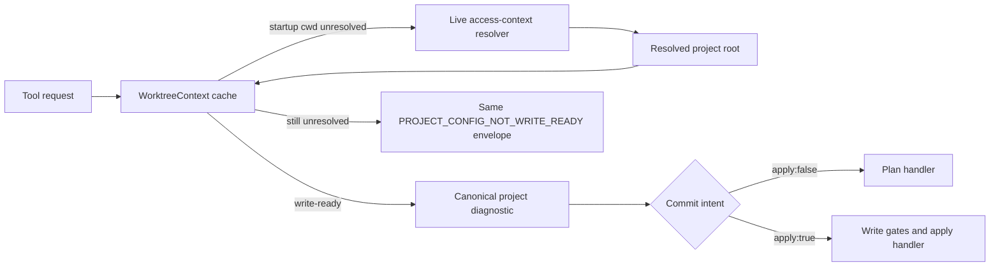

# Plan/apply project resolution

Write-capable MCP tools resolve project identity through one shared path before
they decide whether to preview or commit. This prevents the same explicit
request from resolving successfully in `apply:false` and failing against the
MCP process working directory in `apply:true`.

The fallback is limited to requests carrying an explicit project target. It
uses the live access-context resolver already used by the dynamic service path,
then asks the shared `WorktreeContextCache` for the diagnostic at the resolved
project root. It does not create configuration, bypass write policy, or weaken
project-ID mismatch checks.

Explicit comparison calls (`apply:false` versus `apply:true`) also share the
missing-state check and error wording. Calls that omit `apply` retain the
lightweight degraded-preview behavior for backwards compatibility.
