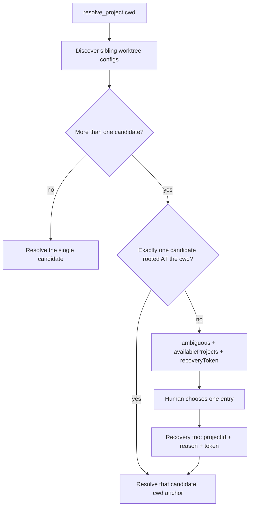

# Worktree-fleet project resolution

`resolve_project` answers one question: *which worktree does this call mean?* This document records
how it answers that question when a fleet of sibling git worktrees all declare the same project id,
and why the cwd — not the project id — is the discriminator of last resort.

## The situation this addresses

The `worktree-per-change` workflow gives one repository many checkouts side by side:

```
00_GESTION_RIESGOS-worktrees/
  p12-riesgo-secundario/.dysflow/project.json   id: gestion-riesgos
  p13-informe-anual/.dysflow/project.json       id: gestion-riesgos
  ...  (14 siblings, all declaring the same id)
```

Every sibling is a legitimate, separately configured project root. Nothing in the project-config
contract requires ids to be unique across worktrees, and in practice they are not: the config file is
committed, so every worktree inherits the same `id` from the branch it was created from.

Sibling discovery is bounded to the current worktree and the git worktrees under its parent
(`discoverWorktreeProjectConfigs`). From inside any one of those 14 directories, discovery therefore
sees 14 candidates.

## The decision

**When the requested cwd is itself one of the discovered project roots, that project is the
resolution. Ambiguity is reserved for a cwd that names none of them.**



## Why the cwd and not the project id

The recovery envelope exists so a human can break a tie the runtime cannot. It breaks ties by
`projectId`. When every candidate carries the same id, that envelope offers N identical choices and
the tie survives the human's answer — the recovery path cannot terminate. The consumer's only escape
was to hand-edit `.dysflow/project.json` in each worktree, which does not scale and defeats the point
of committing the file.

The cwd does not have that defect. It is supplied per call, it is already the way a session targets a
sibling worktree without restarting the MCP (`HR-9`), and it names exactly one directory. The recovery
envelope already relies on it: `consume` filters same-id candidates by `sameProjectRoot(projectRoot,
cwd)` before it will commit a choice. Anchoring the initial resolution to the cwd applies that
existing rule one step earlier, so the fleet never has to enter recovery for a question the cwd had
already answered.

## What this deliberately does not do

- **It does not make ids optional or unique.** Duplicate ids stay legal. `PROJECT_ID_COLLISION` still
  fires when a caller selects a duplicated id through a path that carries no cwd, because there the
  id genuinely identifies more than one project.
- **It does not widen discovery.** The candidate set is unchanged: the current worktree plus sibling
  git worktrees under its parent, never arbitrary roots.
- **It does not resolve a cwd that owns no config.** A directory with no `.dysflow/project.json` is
  not a candidate, so a call from there still returns `ambiguous` with the full envelope. That is the
  case the recovery trio is for, and it remains covered.
- **It does not skip the second ambiguity check.** A worktree whose own config is ambiguous (for
  example, several eligible frontends) still reports `ambiguous` after the anchor selects it. The
  anchor picks a worktree; it does not certify the config inside it.

## Consequences

A consumer driving a duplicate-id fleet resolves each worktree by passing `cwd`, and every downstream
tool (`lint_module`, `verify_code`, `test_vba`, `import_modules`) inherits that resolution. The
recovery trio remains the escape hatch for the genuinely ambiguous vantage point, and its one-shot,
process-local, fingerprint-invalidated contract is unchanged.

The behaviour change is observable: a call that previously returned `ambiguous` from inside a
configured worktree now returns `resolved`. That is the intended correction — the previous result was
not a safety property, it was a discriminator the runtime had but did not consult.

Evidence: `src/adapters/mcp/resolve-project-tool.ts` (the anchor),
`src/adapters/mcp/project-resolution-recovery.ts` (`sameProjectRoot`, the shared rule),
`test/adapters/mcp/round18-resolver-frictions-1668.test.ts` and
`test/adapters/mcp/project-resolution-recovery-1313.test.ts` (the pinned behaviour). Issue #1668.
