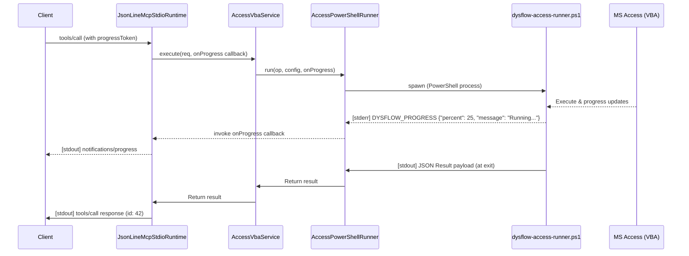

# Exploration: MCP Progress Notifications

This document outlines the findings from exploring how to implement MCP Progress Notifications (protocol version 2024-11-05+) for long-running MS Access/VBA runner operations in `dysflow`.

## Lead Findings

1. **MCP Transport & Custom JSON-RPC Server**:
   - `src/adapters/mcp/stdio.ts` implements a raw, custom `JsonLineMcpStdioRuntime` rather than using the official MCP SDK.
   - It reads request lines from `process.stdin` and writes response JSON lines directly to `process.stdout`.
   - Tool calls are routed through `callTool(params)` where only `params.name` and `params.arguments` are extracted. Any metadata, including `params._meta.progressToken` (which clients use to register for progress updates), is currently discarded.

2. **Runner Stream Constraints**:
   - `src/core/runner/access-runner.ts` spawns `scripts/dysflow-access-runner.ps1` using the `spawnPowerShellProcess` executor.
   - The runner buffers the entire `stdout` stream of the PowerShell process and parses it as a single JSON payload using `JSON.parse()` at the end. Writing progress messages to `stdout` would corrupt this payload and fail with `RUNNER_INVALID_JSON`.
   - Conversely, the runner reads the `stderr` stream in real-time line-by-line (using `onStderr` to intercept process PID markers like `DYSFLOW_ACCESS_PROCESS ...`). This makes `stderr` the ideal side-channel for real-time progress updates.

## Technical Details

### MCP Progress Specification (2024-11-05+)
When a client supports progress tracking, it sends a `progressToken` inside the request's `_meta` object:
```json
{
  "jsonrpc": "2.0",
  "id": 42,
  "method": "tools/call",
  "params": {
    "name": "dysflow.vba.execute",
    "arguments": { ... },
    "_meta": {
      "progressToken": "token-123"
    }
  }
}
```

The server notifies progress by writing JSON-RPC notifications to `stdout`:
```json
{
  "jsonrpc": "2.0",
  "method": "notifications/progress",
  "params": {
    "progressToken": "token-123",
    "progress": 25,
    "total": 100,
    "message": "Processing..."
  }
}
```

### Stream Pipeline Analysis



### PowerShell Progress Emitter
In `scripts/dysflow-access-runner.ps1`, operations can report progress by writing a formatted line to standard error:
```powershell
[Console]::Error.WriteLine('DYSFLOW_PROGRESS ' + (@{ percent = 25; message = "Compiling..." } | ConvertTo-Json -Compress))
```

### VBA Progress Emitter (Optional Windows API)
For in-process VBA executions, VBA code can attach to the parent console and write to the stderr stream:
```vba
#If VBA7 Then
    Private Declare PtrSafe Function GetStdHandle Lib "kernel32" (ByVal nStdHandle As Long) As LongPtr
    Private Declare PtrSafe Function WriteFile Lib "kernel32" (ByVal hFile As LongPtr, ByVal lpBuffer As String, ByVal nNumberOfBytesToWrite As Long, lpNumberOfBytesWritten As Long, ByVal lpOverlapped As LongPtr) As Long
    Private Declare PtrSafe Function AttachConsole Lib "kernel32" (ByVal dwProcessId As Long) As Long
#Else
    Private Declare Function GetStdHandle Lib "kernel32" (ByVal nStdHandle As Long) As Long
    Private Declare Function WriteFile Lib "kernel32" (ByVal hFile As Long) As Long
    Private Declare Function AttachConsole Lib "kernel32" (ByVal dwProcessId As Long) As Long
#End If

Const ATTACH_PARENT_PROCESS As Long = -1
Const STD_ERROR_HANDLE As Long = -12

Public Sub WriteProgress(percent As Long, msg As String)
    Dim hError As LongPtr
    Dim bytesWritten As Long
    Dim text As String
    text = "DYSFLOW_PROGRESS {""percent"":" & percent & ",""message"":""" & msg & """}" & vbCrLf
    AttachConsole ATTACH_PARENT_PROCESS
    hError = GetStdHandle(STD_ERROR_HANDLE)
    If hError <> 0 Then
        WriteFile hError, text, Len(text), bytesWritten, 0
    End If
End Sub
```

## Checklist

- [x] Inspect MCP stdio (`src/adapters/mcp/stdio.ts`)
- [x] Inspect MCP tools (`src/adapters/mcp/tools.ts`)
- [x] Inspect runner stream handling (`src/core/runner/access-runner.ts`)
- [x] Inspect PowerShell script runner (`scripts/dysflow-access-runner.ps1`)
- [x] Formulate stream/side-channel protocol
