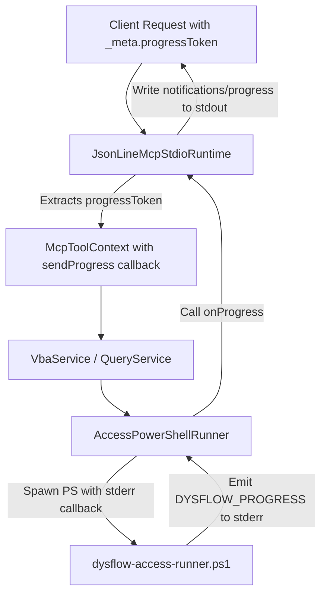

# Proposal: MCP Progress Notifications

## Intent

Implement support for Model Context Protocol (MCP) Progress Notifications (protocol version 2024-11-05+) to provide real-time updates for long-running MS Access and VBA operations, preventing client timeouts and improving user experience.

## Scope

### In Scope
- Extract `progressToken` from client requests (`params._meta.progressToken`) in `JsonLineMcpStdioRuntime`.
- Introduce a progress callback context (`McpToolContext`) passed to tool handlers.
- Extend `AccessRunner.run` and core services (`vbaService`, `queryService`) to support an optional progress callback.
- Intercept real-time `stderr` lines prefixed with `DYSFLOW_PROGRESS ` in the PowerShell runner, parsing and forwarding them to the progress callback.
- Update `scripts/dysflow-access-runner.ps1` to write progress updates during multi-step processes (e.g. executing scripts, queries, importing query definitions, or when invoked within VBA).

### Out of Scope
- Rewriting stdout buffering in `spawnPowerShellProcess`.
- Modifying legacy tools that do not execute via `AccessPowerShellRunner`.

## Capabilities

### New Capabilities
- Real-time progress updates (`notifications/progress` JSON-RPC messages) streamed to progress-aware MCP clients.

### Modified Capabilities
- `mcp-stdio-adapter`: accepts and processes `_meta.progressToken`.
- `access-core-runner`: listens for real-time progress markers on `stderr` and raises callback events.

## Approach



### 1. Protocol Parse (MCP Side)
Extract `_meta.progressToken` inside `callTool` and expose a context object `McpToolContext`:
```typescript
export interface McpToolContext {
  progressToken?: string | number;
  sendProgress?(progress: number, total?: number, message?: string): void;
}
```

### 2. Side-Channel Progress Format (Runner Side)
PowerShell writes progress to stderr:
```
DYSFLOW_PROGRESS {"percent": 50, "total": 100, "message": "Importing query definitions..."}
```

Node runner parses this prefix in `onStderr`:
```typescript
if (line.startsWith("DYSFLOW_PROGRESS ")) {
  try {
    const data = JSON.parse(line.slice(17));
    options.onProgress?.(data.percent, data.total, data.message);
  } catch {
    // Fail silently on malformed progress lines to prevent runner crashes
  }
}
```

### 3. Backward Compatibility
- If `progressToken` is not provided, `sendProgress` remains undefined, and no progress notifications are written to stdout. This preserves compatibility with older or non-progress-aware clients.
- If a progress line fails to parse, it is treated as regular stderr log output (or discarded) to prevent interrupting active executions.

## Affected Areas

| Area | Impact | Description |
|------|--------|-------------|
| `src/adapters/mcp/stdio.ts` | Modified | Parse `_meta.progressToken` and map to `McpToolContext`. Implement `sendProgressNotification`. |
| `src/adapters/mcp/tools.ts` | Modified | Add `McpToolContext` parameter to `DysflowMcpTool.handler` signatures. Pass `onProgress` callbacks to services. |
| `src/core/runner/access-runner.ts` | Modified | Accept `onProgress` callback in options and parse `DYSFLOW_PROGRESS ` from runner stderr. |
| `src/core/services/vba-service.ts` | Modified | Forward progress callbacks from handler context to runner. |
| `src/core/services/query-service.ts` | Modified | Forward progress callbacks from handler context to runner. |
| `scripts/dysflow-access-runner.ps1` | Modified | Add helper functions to write progress lines to stderr. Emit progress during long loops (e.g. importing queries, seeding fixtures). |

## Risks

| Risk | Likelihood | Mitigation |
|------|------------|------------|
| Malformed progress lines crash the runner | Low | Wrap progress parsing in a try-catch block and ignore parse errors. |
| Progress notification messages clash with tool responses on stdout | Low | The `stdio.ts` output is synchronous; single lines of JSON-RPC are safe to write as they are formatted as valid JSON-RPC frames. |
| Client doesn't support progress notifications | Low | Check for presence of `progressToken` before emitting any notifications. |

## Rollback Plan

Revert the changes in `stdio.ts`, `tools.ts`, `access-runner.ts`, services, and `dysflow-access-runner.ps1`.

## Success Criteria

- [ ] `stdio.ts` correctly parses `_meta.progressToken` and generates `notifications/progress` JSON-RPC frames.
- [ ] `access-runner.ts` successfully parses `DYSFLOW_PROGRESS ` stderr markers and triggers progress callbacks.
- [ ] PowerShell script outputs valid progress markers during sequential query imports or execution.
- [ ] Clients without progress tokens receive responses normally without errors or notifications.
