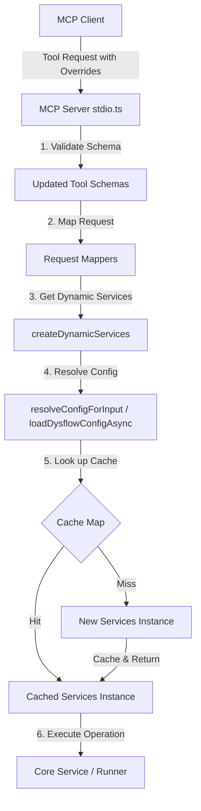

# Design: MCP Override Validation Alignment

## Technical Approach

We will replace the static service initialization in the MCP adapter (`stdio.ts`) with a dynamic service wrapper called `createDynamicServices`. On every request, this wrapper resolves configuration overrides (`timeoutMs`, `accessPath`, `projectRoot`, etc.) dynamically via `resolveConfigForInput`, instantiating and caching new `DysflowMcpServices` instances on-demand. 

This maps to the proposal's approach by providing a unified service path for both normal and degraded states, preventing operation leakage with cache keys derived from the resolved configuration, and ensuring per-call overrides are fully respected.

## Architecture Decisions

### Decision: Dynamic Services Wrapping vs Core Target Resolution

| Option | Tradeoff | Decision |
|--------|----------|----------|
| **Core Target Resolution** | Moves configuration loading and resolution logic directly into core services. Breaks hexagonal design by leaking adapter-level execution context/configuration concerns into the core domain. | Rejected |
| **Dynamic Services Wrapper** | Wrap all services dynamically at the adapter layer (`stdio.ts`). Keeps core services simple and stateless, preserving Clean Architecture boundaries. Reuses config-based cache to avoid redundant service instantiation. | **Chosen** |

### Decision: Operation Registry Delegation

| Option | Tradeoff | Decision |
|--------|----------|----------|
| **Global/Static Registry** | Keep registry static while wrapping other services. Operations lists and cleanups might target wrong registry files if project roots differ from startup. | Rejected |
| **Dynamic Registry Routing** | Wrap `operationRegistry` to delegate reads/writes to the resolved dynamic services instance. Fallback to startup or temporary memory registry when no context is provided. | **Chosen** |

## Data Flow



## File Changes

| File | Action | Description |
|------|--------|-------------|
| `src/core/contracts/index.ts` | Modify | Update `AccessVbaRequest` and `AccessQueryRequest` to include optional context, override, and strict context properties. |
| `src/core/runner/access-runner.ts` | Modify | Include optional overrides in `AccessDiagnosticsRequest`. |
| `src/core/mapping/access-query-request-mapper.ts` | Modify | Update `buildQueryReadRequest`, `buildWriteFixtureRequest`, and `buildMaintenanceRequest` to map overrides (`timeoutMs`, paths, context IDs) into request envelopes. |
| `src/core/config/execution-target.ts` | Modify | Update `resolveExecutionTarget` to pass `timeoutMs` to `loadDysflowConfigAsync` options and override the fallback target timeout. |
| `src/adapters/mcp/schemas/vba-sync-schemas.ts` | Modify | Update `run_vba` and `cleanup_access_operation` schemas to support context, overrides, and strict context parameters. |
| `src/adapters/mcp/schemas/query-schemas.ts` | Modify | Update `relink_directory` schema to support context and path overrides. |
| `src/adapters/mcp/schemas/dysflow-schemas.ts` | Modify | Update `VBA_EXECUTE_SCHEMA` and `DOCTOR_SCHEMA` to allow overrides and strict context. |
| `src/adapters/mcp/alias-tools.ts` | Modify | Update `run_vba` and `cleanup_access_operation` mappers to forward overrides. |
| `src/adapters/mcp/stdio.ts` | Modify | Implement `createDynamicServices` wrapping all services dynamically. Update `resolveConfigForInput` to pass `timeoutMs` to `loadDysflowConfigAsync`. Always use the dynamic service wrapper. |
| `test/adapters/mcp/stdio.test.ts` | Modify | Add unit tests for `createDynamicServices` caching, config resolution, and overrides. |
| `test/core/mapping/access-query-request-mapper.test.ts` | Modify | Update mapper tests to assert override properties are correctly mapped. |
| `test/shared/validation/validator.test.ts` | Modify | Add schema validation tests verifying override fields are permitted. |

## Interfaces / Contracts

```typescript
// src/core/contracts/index.ts
export type AccessVbaRequest = {
  moduleName: string;
  procedureName: string;
  arguments?: readonly unknown[];
  // Overrides
  projectId?: string;
  contextId?: string;
  accessPath?: string;
  backendPath?: string;
  destinationRoot?: string;
  projectRoot?: string;
  timeoutMs?: number;
  strictContext?: boolean;
  expectedAccessPath?: string;
  expectedProjectRoot?: string;
  expectedDestinationRoot?: string;
};

// src/adapters/mcp/stdio.ts
export function createDynamicServices(
  startupConfig?: DysflowConfig,
  startupError?: DysflowError,
  options?: {
    cwd?: string;
    env?: Record<string, string | undefined>;
    serviceFactory?: (config: DysflowConfig) => DysflowMcpServices;
  },
): DysflowMcpServices;
```

## Testing Strategy

| Layer | What to Test | Approach |
|-------|-------------|----------|
| Unit | Validator & Schemas | Verify updated tool schemas (`run_vba`, `dysflow_vba_execute`, `dysflow_doctor`, `relink_directory`, `cleanup_access_operation`) allow override fields without validation failures. |
| Unit | Request Mappers | Verify `access-query-request-mapper` and tool handlers map overrides (`timeoutMs`, paths, context IDs) into request envelopes correctly. |
| Unit | `createDynamicServices` & Resolution | Verify that `createDynamicServices` resolves configuration, uses caching correctly, isolates configs, and propagates `timeoutMs` override. |
| Integration / E2E | End-to-End Overrides | Invoke MCP tools via `startWithSdkServer` mock harness using dynamic configurations to verify correct execution targets and timeouts. |

## Migration / Rollout

No migration required. The changes are fully backward-compatible and apply to runtime request flows.

## Open Questions

None. The implementation details are aligned with existing conventions in the repository.
