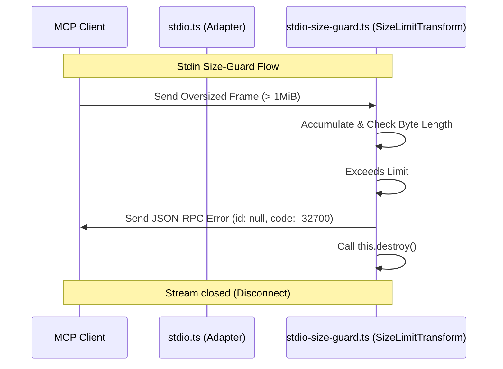

# Design: MCP Hardening and Parity Improvements

## Technical Approach

We will address the security, parity, and robustness issues identified in the MCP adapter audit by implementing:
1. **Regex Blocklist Validation**: Inline VBA execution snippets will be validated against a case-insensitive word-boundary regex blocklist check (`\bDeclare\b`, `\bShell\b`, `\bCreateObject\b`, `\bGetObject\b`, `\bLib\b`) before target resolution or disk I/O.
2. **Standardized dryRun Defaults**: Align write tools to default to plan mode (`dryRun: true`) unless `apply === true` or `dryRun === false`.
3. **Immediate Size Limit Stream Tear-down**: Modify `SizeLimitTransform` to call `this.destroy()` immediately after writing the size-limit violation error frame.
4. **OperationResult listOrphans Integration**: Refactor the core `listOrphans` function to return `OperationResult<AccessOrphanCandidate[]>` to safely propagate scanning and execution errors.

## Architecture Decisions

### Decision: Inline Regex Blocklist
- **Choice**: Validate inline snippets with a case-insensitive regex utilizing `\b` word boundaries.
- **Alternatives considered**: Lexical/AST parsing of VBA code.
- **Rationale**: VBA lexical parsing is complex and error-prone; a word-boundary regex is highly effective at stopping standard unsafe keyword invocations (`CreateObject`, `Shell`) without producing excessive false positives on valid identifier names (e.g., `MyLibrary` or `ShellSort`).

### Decision: Stream Destruction on Violation
- **Choice**: Invoke `this.destroy()` immediately after emitting the error frame on `SizeLimitTransform`.
- **Alternatives considered**: Relying on downstream JSON-RPC parser to disconnect on invalid frames.
- **Rationale**: Downstream components can hang if they wait for additional input. Explicitly destroying the stream closes `process.stdin`'s pipe cascade, forcing a clean, immediate disconnect.

## Data Flow



## File Changes

| File | Action | Description |
|------|--------|-------------|
| `src/adapters/vba-sync/vba-execution-adapter.ts` | Modify | - Add regex validation to `executeInline` before resolving execution target. Validate case-insensitively on `\bDeclare\b`, `\bShell\b`, `\bCreateObject\b`, `\bGetObject\b`, `\bLib\b`. Return `INVALID_INPUT` if blocked. |
| `src/adapters/vba-sync/vba-modules-adapter.ts` | Modify | - Update `dryRun` resolution in `execute` for `import_modules` and `import_all` using `params.apply === true ? false : params.dryRun !== false`. |
| `src/core/services/vba-form-service.ts` | Modify | - Update `dryRun` resolution in `generateForm` using `params.apply === true ? false : params.dryRun !== false`. |
| `src/adapters/mcp/stdio-size-guard.ts` | Modify | - Inside `emitSizeError`, invoke `this.destroy()` after writing the JSON-RPC error frame. |
| `src/core/operations/access-orphan-cleanup.ts` | Modify | - Change signature of `listOrphans` to return `Promise<OperationResult<AccessOrphanCandidate[]>>`. Return `PROCESS_SCAN_FAILED` failureResult if process scanning fails. Wrap successful candidates in `successResult`. |
| `src/adapters/mcp/result-translation.ts` | Modify | - Update `DysflowMcpServices["orphanCleanupService"]["listOrphans"]` signature to return `Promise<OperationResult<readonly AccessOrphanCandidate[]>>`. |
| `src/adapters/mcp/stdio.ts` | Modify | - Update service bridge `orphanCleanupService.listOrphans` to return the `OperationResult` or `failureResult` instead of throwing. |
| `src/adapters/mcp/canonical-handlers.ts` | Modify | - Remove `successResult` wrapping in `handleMcpAccessOrphanCleanup` since `listOrphans` returns `OperationResult` directly. |

## Interfaces / Contracts

### Regex Blocklist Validation
```typescript
const INLINE_BLOCKLIST_REGEX = /\b(Declare|Shell|CreateObject|GetObject|Lib)\b/i;
```

### dryRun Resolution Helper
```typescript
function resolveIsDryRun(params: Record<string, unknown>): boolean {
  return params.apply === true ? false : params.dryRun !== false;
}
```

### Updated listOrphans Signature
```typescript
async listOrphans(
  request: AccessOrphanCleanupRequest
): Promise<OperationResult<AccessOrphanCandidate[]>>
```

## Testing Strategy

| Layer | What to Test | Approach |
|-------|-------------|----------|
| Unit | - Inline validation blocklist | Assert code containing blocklisted words (with/without case variation) is rejected. Assert that concatenated words (e.g., `MyLib`) pass. |
| Unit | - dryRun defaults | Verify `import_modules`, `import_all`, and `generateForm` default to plan mode. |
| Unit | - Size limit closure | Verify `SizeLimitTransform` calls `destroy` and emits `'close'` after size limit violation. |
| Unit | - listOrphans error propagation | Verify `listOrphans` propagates scanner failures as `OperationResult` instead of returning an empty array. |
