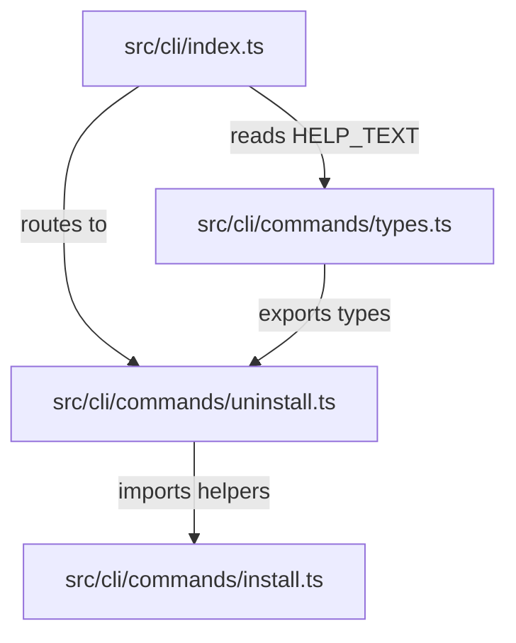

# Design: `dysflow uninstall` command

## Outcome
A modular, test-driven implementation plan that leverages existing helpers from `install.ts` to revert MCP integrations, delete the runtime directory, and clean up system marker files.

---

## 1. Code Architecture & Component Splits

We will modify the CLI command registry and types to incorporate the new `uninstall` command, and place the execution logic in a dedicated command handler file.



### A. Export Helpers in `src/cli/commands/install.ts`
To reuse existing logic and avoid duplication, change the following definitions from local functions to exported functions:
```typescript
export function resolveRuntimeDir(runtimeOverride: string | undefined, env: NodeJS.ProcessEnv): string;
export function getSystemMarkerPath(env: NodeJS.ProcessEnv): string;
export function getHome(env: NodeJS.ProcessEnv): string;
export function resolveAgentConfigPaths(home: string): AgentConfigPaths;
export async function removeAgentConfig(agent: AgentName, agentConfigPaths: AgentConfigPaths): Promise<void>;
export async function fileExists(filePath: string): Promise<boolean>;
```

### B. Create `src/cli/commands/uninstall.ts`
Implement the parsing and command execution logic.

* **Parsing function**: `parseUninstallArgs` parses arguments and handles option validation.
* **Execution function**: `handleUninstallCommand` orchestrates:
  1. Resolving the runtime directory, marker path, home directory, and agent configuration paths.
  2. Iterating through `ALL_AGENTS` and calling `removeAgentConfig(agent, agentConfigPaths)`.
  3. Removing the runtime directory recursively if it exists, using `rm(runtimeDir, { recursive: true, force: true })`.
  4. Deleting the marker file `markerPath` if it exists.
  5. Attempting to delete the parent directory of the marker file if it is empty (using `rm(markerDir, { recursive: false })` wrapped in a silent try-catch).
  6. Cleaning up context environment variables (`DYSFLOW_HOME` and `DYSFLOW_RUNTIME_MARKER_PATH`) if `context.env` is provided.
  7. Formulating the success report or warning messages.

### C. Update `src/cli/commands/types.ts`
Add the help entry to `HELP_TEXT`:
```typescript
"  uninstall Run Dysflow uninstaller (revert integrations + clean runtime)"
```

### D. Update `src/cli/index.ts`
Add command routing inside `COMMANDS` registry:
```typescript
import { handleUninstallCommand } from "./commands/uninstall.js";
...
const COMMANDS = new Map<string, CommandHandler>([
	...
	["uninstall", handleUninstallCommand],
]);
```

---

## 2. Test Suite & Mocking Plan (`test/cli/uninstall.test.ts`)

Under **STRICT TDD MODE**, all functionality will be driven by new unit and integration tests written in `test/cli/uninstall.test.ts`.

### A. Setup Mock Environment
To isolate tests and prevent polluting the actual user profile, each test case will:
1. Create a unique temporary directory via `await mkdtemp(join(tmpdir(), "dysflow-uninstall-test-"))`.
2. Configure a mocked environment object `mockEnv` with:
   - `USERPROFILE` / `HOME` pointing to the temp directory.
   - `LOCALAPPDATA` pointing to a subdirectory within the temp directory.
   - `ProgramData` pointing to a subdirectory within the temp directory.
   - `DYSFLOW_HOME` and `DYSFLOW_RUNTIME_MARKER_PATH` appropriately mocked.
3. Pass `mockEnv` via `context.env` to `handleUninstallCommand`.

### B. Mocking Agent Configuration Files
We will write helper functions to construct mock agent configs containing both Dysflow and dummy configs to ensure uninstallation is surgical (only removing Dysflow):
* **Codex**: Write a TOML file with a `[mcp_servers.other]` section and a `[mcp_servers.dysflow]` section.
* **OpenCode**: Write a JSON file with `mcp.other` and `mcp.dysflow` entries.
* **Claude Desktop**: Write a JSON file with `mcpServers.other` and `mcpServers.dysflow` entries.
* **Claude Settings**: Write a JSON file with `mcpServers.other` and `mcpServers.dysflow` entries.
* **Pi**: Write a JSON file with `mcpServers.other` and `mcpServers.dysflow` entries.

Verification will assert:
1. `hasDysflowMcpConfig` returns `false` after uninstallation.
2. The config files still exist and contain the `other` configuration intact.

### C. Mocking Runtime and Marker Directories
* Create a dummy runtime directory containing `bin/dysflow.cmd`, `app/`, `README.md`, etc.
* Write a dummy marker file `.dysflow-marker` at the mocked system marker path.
* After calling `handleUninstallCommand`:
  - Assert that the runtime directory is deleted.
  - Assert that the marker file is deleted.
  - Assert that the marker folder is deleted if it contains no other files.

### D. Test Cases

| Test Category | Target Case | Verification |
| :--- | :--- | :--- |
| **CLI Arguments** | Show help | `--help` / `-h` prints `UNINSTALL_USAGE` and exits with code `0`. |
| | Unknown arguments | Fails with exit code `1` and descriptive stderr. |
| | Invalid `--runtime-dir` | Missing value or option start (`--`) fails with exit code `1`. |
| **Integrations** | Surgical remove | Agent config files lose `dysflow` server settings; other server settings remain. |
| | Missing configs | Uninstallation completes successfully (no crash) if config folders/files are absent. |
| **File Deletions** | Runtime folder | Resolved/custom runtime directory is deleted recursively. |
| | Marker file | System marker file is deleted, and its parent folder is cleaned up if empty. |
| **Environment** | Context cleanup | `context.env.DYSFLOW_HOME` and `DYSFLOW_RUNTIME_MARKER_PATH` are deleted. |
| | Shell warning | Warning logs printed on stdout if variables exist in `process.env`. |
