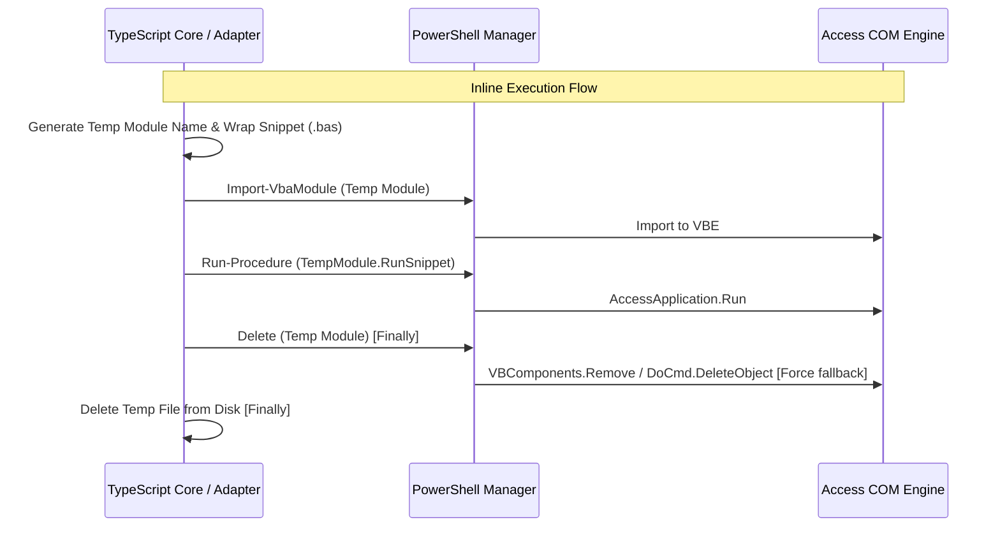

# Design: Resolve MCP and VBA Synchronization Frictions

## Technical Approach

We will address synchronization frictions by implementing:
1. **Fallback Delete**: Catching COM HRESULT `0x800ADEB9` in `Remove-AccessObjectOrComponent` and using `DoCmd.DeleteObject` if `Force` is enabled.
2. **Orphan Auditing**: Comparing local disk source files with the database inventory fetched from VBE/DAO.
3. **Consistent Write-Gating**: Gating VBA modifying tools in the MCP adapter, explicitly reporting the blocked tool name.
4. **Inline Execution**: Wrapping user VBA snippets in a temporary module, executing, and cleaning up both the database and file system.
5. **COM HRESULT Translation**: Translating opaque COM error codes to bilingual troubleshooting advice.

## Architecture Decisions

### Decision: Inline Execution Wrapper
**Choice**: TypeScript-orchestrated file creation, import, execution, and cleanup.
**Alternatives considered**: Direct VBE memory manipulation (unstable in locked-down environments).
**Rationale**: Reuses the stable, tested import/delete script pipelines and works without trusting VBA project access.

## Data Flow



## File Changes

| File | Action | Description |
|------|--------|-------------|
| `scripts/dysflow-vba-manager.ps1` | Modify | - Catch `0x800ADEB9` in `Remove-AccessObjectOrComponent`, fallback to `DoCmd.DeleteObject` (using resolved kind mapping: `acModule` = 5, `acForm` = 2, `acReport` = 3).<br>- Revert `Invoke-ExportAction` `try/catch` regression to propagate exceptions as expected by tests. |
| `src/core/utils/sanitize-error.ts` | Modify | Translate COM HRESULTs (e.g. `0x800ADEB9`, `0x800A09D5`) into bilingual user action items. |
| `src/adapters/vba-sync/vba-modules-adapter.ts` | Modify | Add `audit_orphans` implementation (fetching directory items vs VBE catalog). |
| `src/adapters/vba-sync/vba-execution-adapter.ts` | Modify | Implement the `vba_inline_execution` orchestrator with a guaranteed cleanup `finally` block. |
| `src/adapters/mcp/dispatch-factory.ts` | Modify | Enforce consistent write-gating for VBA write tools and pass tool name to `writesDisabled`. |
| `src/adapters/mcp/dispatch-common.ts` | Modify | Update `writesDisabled` to accept and name the specific blocked tool. |
| `scripts/tests/dysflow-vba-manager.Tests.ps1` | Modify | Stub missing functions `Get-AccessObjectNames` and `Resolve-AccessObjectInfo` in the AST-extracted test context. |

## Interfaces / Contracts

### Tool: `vba_orphan_audit`
- **Input**: `{ projectRoot?: string, destinationRoot?: string }`
- **Output**:
```typescript
interface AuditResult {
  orphans: string[];      // Disk files without database objects
  placeholders: string[]; // Database objects without disk files
  duplicates: string[];   // Naming collisions/duplicate locations
}
```

### Tool: `vba_inline_execution`
- **Input**: `{ code: string }`
- **Output**: `{ ok: boolean, returnValue: unknown, error?: string }`

## Testing Strategy

| Layer | What to Test | Approach |
|-------|-------------|----------|
| Unit | - Write gating logic<br>- HRESULT Translation | Mock adapter dependencies, verify correct error message containing tool name, verify correct translation of HRESULT error strings. |
| Integration | - `audit_orphans`<br>- `vba_inline_execution` | Spawn PowerShell runner stub, mock filesystem scenarios (orphans, duplicates), and check JSON serialization. |
| E2E | - Inline execution workflow | Compile and run a basic VBA snippet against a test database, asserting execution output and verifying that the temporary module was successfully deleted. |
| Pester | - `Invoke-ExportAction` | Mock helper functions `Get-AccessObjectNames` and `Resolve-AccessObjectInfo` in tests, verify exception propagation by throwing in mocked calls. |
