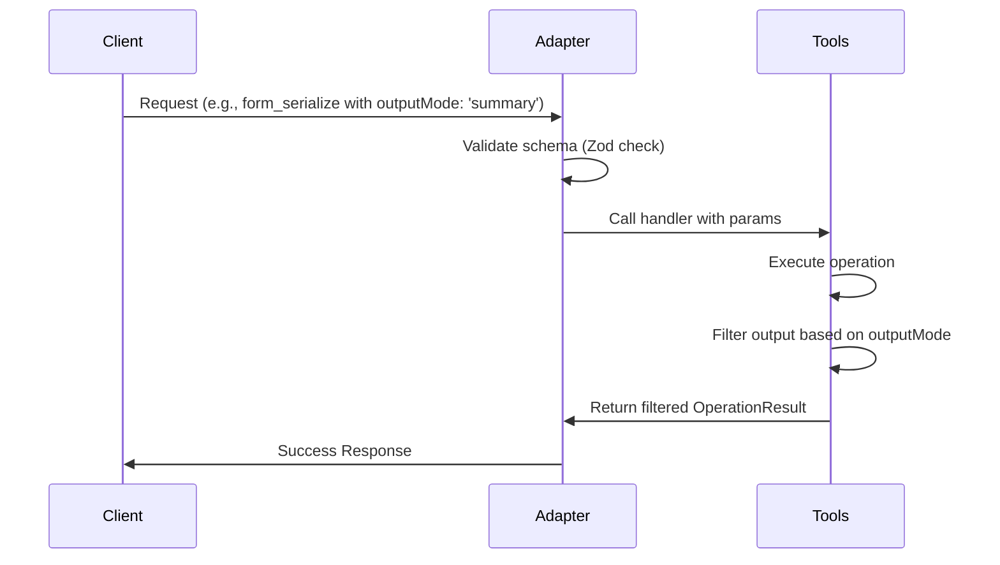

# Technical Design: Unified Forms Output Modes

## 1. Architecture Decisions & Rationale

*   **Decision 1 (Zod validation definition):** Add `outputMode` enum (`"summary" | "file" | "full"`) and deprecated `includeSerialized` boolean to `SCHEMA_PROPS` in `src/shared/validation/schema-props.ts`.
    *   *Rationale:* This prevents validation failure (via `additionalProperties: false`) on MCP and HTTP interfaces when callers pass these new/legacy parameters. Reusing atom definitions ensures consistent validation across the whole system.
*   **Decision 2 (Fallback Strategy):**
    *   For `form_serialize`: If `outputMode` is omitted, resolve via `includeSerialized`. If `includeSerialized` is true, output mode is `"full"`; if false or omitted, it is `"summary"`.
    *   For other tools: If `outputMode` is omitted, default to `"full"`.
    *   *Rationale:* Preserves backward compatibility. Existing serialize callers expect the code to be omitted unless explicitly opted in. Mutation and cloning callers expect full details including target source previews by default.
*   **Decision 3 (Dry-Run Filtering for Mutations and Deserialization):**
    *   Summary mode: Omit `preview` (deserialization), `source` (mutation), or `targetSource` (cloning).
    *   File mode: Return ONLY target code and primary path/name metadata (`sourcePath`, `targetPath`, `serialized`, `preview`, `source`, `targetSource`), and omit other metadata (e.g. `mode`, `appliedChecksums`, `importGate`, `preservedKeys`).
    *   *Rationale:* Omit large source codes to drastically reduce response payload sizes for AI clients in `"summary"` mode. In `"file"` mode, minimize parsing complexity by providing only target source code and identifiers.

## 2. Interface Changes & Data Flow

### Schemas (`vba-sync-schemas.ts`)
Optional `outputMode` and `includeSerialized` schemas added to target tools.

## 3. Detailed File Changes

### 3.1. [schema-props.ts](file:///C:/Users/adm1/.gemini/antigravity-cli/worktrees/issue-793/src/shared/validation/schema-props.ts)
Add properties:
- `outputMode`: Enum (`"summary"`, `"file"`, `"full"`).
- `includeSerialized`: Boolean (deprecated).

### 3.2. [vba-sync-schemas.ts](file:///C:/Users/adm1/.gemini/antigravity-cli/worktrees/issue-793/src/adapters/mcp/schemas/vba-sync-schemas.ts)
Integrate `outputMode` into `form_serialize`, `form_deserialize`, `form_add_control`, `form_move_control`, `form_rename_control`, and `create_form_from_template`.
Integrate `includeSerialized` into `form_serialize`.

### 3.3. [vba-forms-serialization-tools.ts](file:///C:/Users/adm1/.gemini/antigravity-cli/worktrees/issue-793/src/adapters/vba-sync/vba-forms-serialization-tools.ts)
- **`serializeForm`**: Resolve `outputMode` via parameter mapping. Filter returned success object based on `outputMode`.
- **`deserializeForm`**: Retrieve `outputMode` defaulting to `"full"`. In `!apply` block, return filtered successResult.

### 3.4. [vba-forms-mutation-tools.ts](file:///C:/Users/adm1/.gemini/antigravity-cli/worktrees/issue-793/src/adapters/vba-sync/vba-forms-mutation-tools.ts)
- **`mutateForm`**: Retrieve `outputMode` defaulting to `"full"`. Filter dry-run return object accordingly.

### 3.5. [vba-forms-clone-tools.ts](file:///C:/Users/adm1/.gemini/antigravity-cli/worktrees/issue-793/src/adapters/vba-sync/vba-forms-clone-tools.ts)
- **`cloneFormFromTemplate`**: Retrieve `outputMode` defaulting to `"full"`. Filter dry-run and apply return objects to omit/include `targetSource` and other properties.

## 4. Testing Strategy

*   **Unit & Integration Tests**: Expand existing suites in `test/adapters/vba-sync/` to test all three output modes:
    *   Verify schema validation accepts and rejects correct values.
    *   Assert output shapes for `"summary"`, `"file"`, and `"full"` modes for all 6 tools.
    *   Verify backward compatibility behavior for `form_serialize`.
